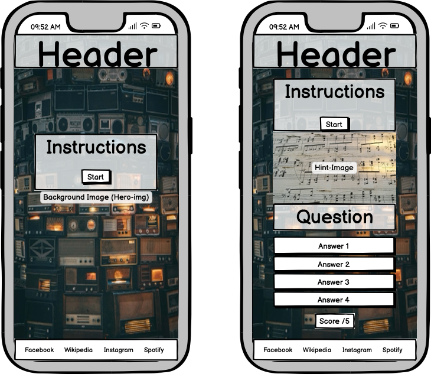
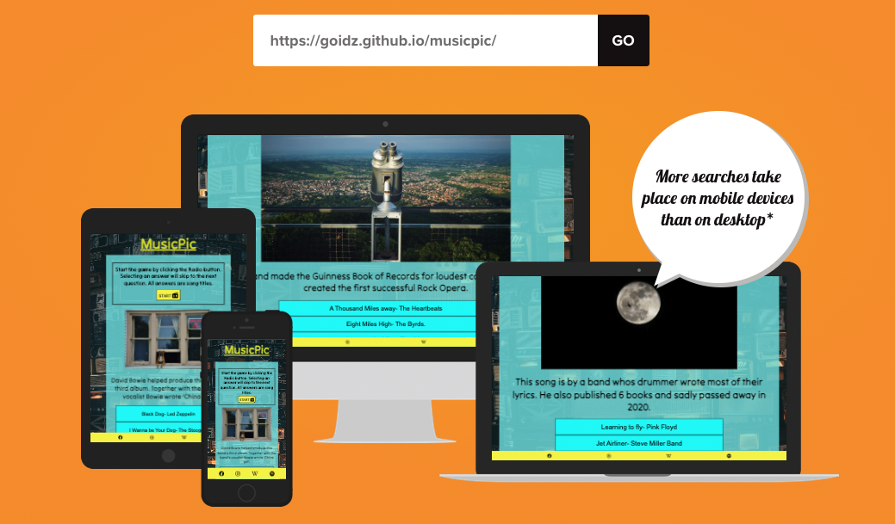
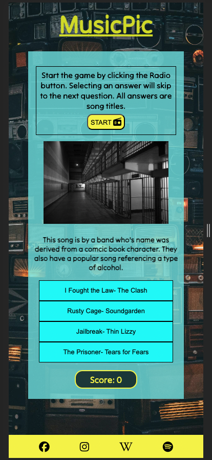
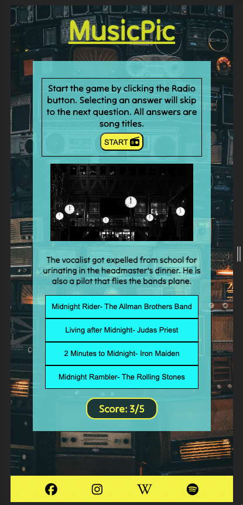
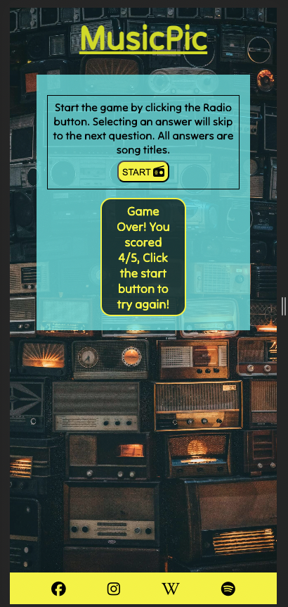
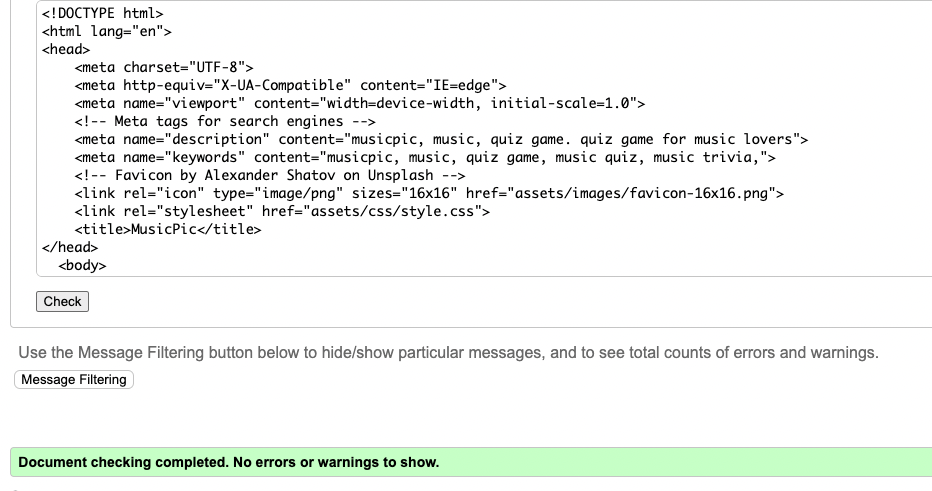
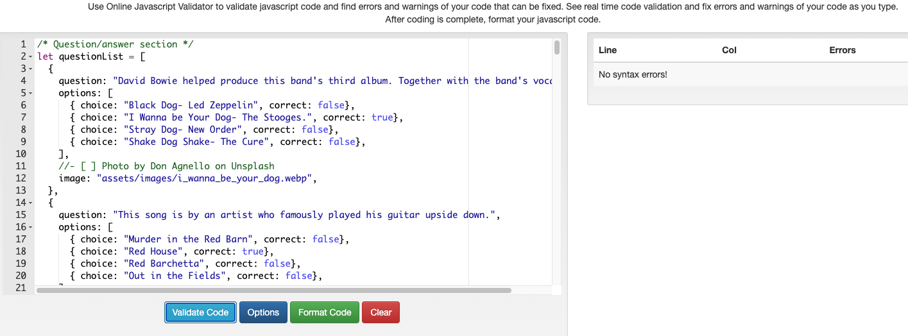
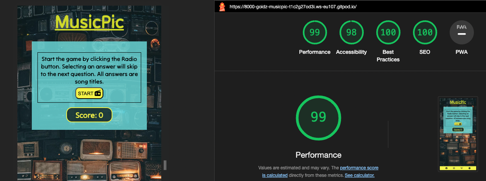
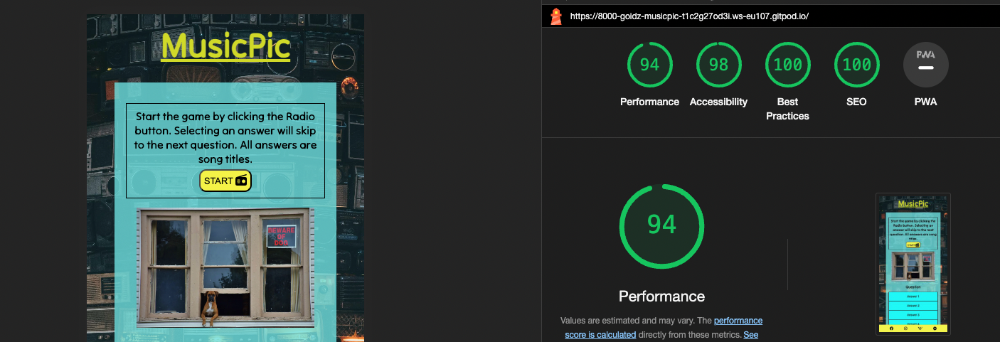

# MusicPic.
This is my portfolio2 project for the Code Institute Full-stack developer course.

MusicPic is an in-hand music quiz mainly aimed at people on the go. The idea of the website is to be something fun to do on your way to work, for example. 
I tried to develop a website that is easy to use and navigate. 
Test your knowledge on music and have fun by yourself or with others, at a game night. 
Easy access to Spotify is already in the app and Wikipedia is linked at the bottom also if the user wants to expand on what they've learnt. 
I have gotten great feedback the only negative comments being a small question pool. I hope to increase this in the future. 

[Welcome to MusicPic!](https://goidz.github.io/musicpic/)

## Project planning.

### The site's Wireframe.

I started this project by creating a wireframe using Balsamic.

## Layout and features.

 

[Used amiresponsive for responsivity testing](https://amiresponsive.co.uk.)

### The landing page.

The landing page consists of a Header in bright yellow, a themed background of old radios and an area with instructions and a start button which takes you to the game page.
Located at the bottom of the page are links to Facebook, Instagram, Spotify and Wikipedia. The latter two are features added for the user to have easy access to expand upon the game. By using Spotify one could easily add a music streaming element to the game. Wikipedia adds extra information on a topic at hand. 

### Game page.

The game page are again made up of the header and instrucctions.

Underneath is the hint-image. 
The image is related to a song-title.

Below the hint-image is a clue written in the form of an anecdote or fact.

Following the image players have a multiple-choice button area to make a selection from. 
After each question the current score is shown beneath this area.
After 5 questions a score is presented out of 5 and a possibility to restart a new game. 

### Game page in progress.

### Game page- game over.

## Testing.

### The following testing was carriend out:

+ Ran the HTML code through W3C-HTML validator, resulting in no errors.

  

+ Ran the CSS code through W3C-CSS validator, resulting in no errors

  

+ Ran the Javascript code through Beautify Tools validator, resulting in no errors

Tested the the landing page in Google Lighthouse and got adequite results.

Tested the the game page in Google Lighthouse and got adequite results.

