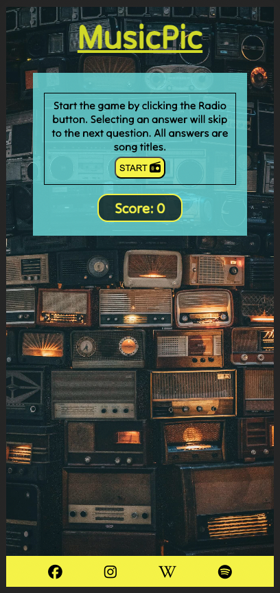

# MusicPic.
This is my portfolio2 project for the Code Institute Full-stack developer course.

MusicPic is an in-hand music quiz mainly aimed at people on the go. The idea of the website is to be something fun to do on your way to work, for example. 
I tried to develop a website that is easy to use and navigate. 
Test your knowledge on music and have fun by yourself or with others, at a game night. 
Easy access to Spotify is already in the app and Wikipedia is linked at the bottom also if the user wants to expand on what they've learnt. 
I have gotten great feedback the only negative comments being a small question pool. I hope to increase this in the future. 

[Welcome to MusicPic!](https://goidz.github.io/musicpic/)

## Project planning.

### The site's Wireframe.

I started this project by creating a wireframe using Balsamic.

## Layout and features.

### The landing page.

The landing page consists of a Header in bright yellow, a themed background of old radios and an area with instructions and a start button which takes you to the game page.
Located at the bottom of the page are links to Facebook, Instagram, Spotify and Wikipedia. The latter two are features added for the user to have easy access to expand upon the game. By using Spotify one could easily add a music streaming element to the game. Wikipedia adds extra information on a topic at hand. 

The questions are based on a combination of an image and a hint. 
Players have a multiple-choice button area to make a selection from. After 5 questions a score is presented out of 5 and a possibility to restart a new game. 

